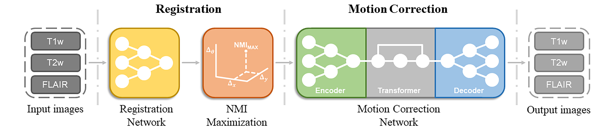
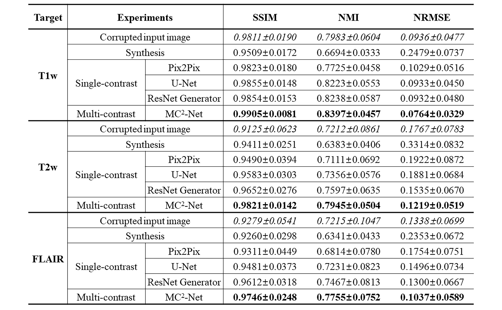

# MC<sup>2</sup>-Net: Motion Correction Network for Multi-Contrast Brain MRI

Tensorflow implementation of "MC<sup>2</sup>-Net: Motion Correction Network for Multi-Contrast Brain MRI" 



Contact: Jongyeon Lee, KAIST (jyl4you@kaist.ac.kr)

## Paper
[MC<sup>2</sup>-Net: Motion Correction Network for Multi-Contrast Brain MRI]() <br />
Jongyeon Lee, Byungjai Kim, and [Hyunwook Park](http://athena.kaist.ac.kr) <br />
(Under review)

Please cite our paper if you find it useful for your research. (Currently under review for MRM)

```
@inproceedings{,
  author = {Jongyeon Lee, Byungjai Kim, HyunWook Park},
  booktitle = {Magnetic Resonance in Medicine},
  title = {MC2-Net: Motion Correction Network for Multi-Contrast Brain MRI},
  year = {2021}
}
```

## Example Results


## Quantitative Reuslts



## Installation
* Install Tensorflow-gpu 2.2.0 with Python 3.6 and CUDA 10.2

```
pip install -r requirements.txt
```
or
```
conda create -r [ENV_NAME] python=3.6
conda activate [ENV_NAME]
conda install tensorflow-gpu=2.2.0 scikit-image=0.16.2
```

* Clone this repo
```
git clone https://github.com/OpenXAIProject/mc2-net.git
cd mc2-net
```

## Dataset
* Dataset used for this study is not the public data. The sample images are in data directory for demo.
* You may use [BraTS 2020](https://ipp.cbica.upenn.edu/#BraTS20_registration) as an alternative dataset. To generate the data for training, please refer to the paper and Figure 4 for motion simulation. This step is not implmented in Python code due to its dependency on pulse sequences.

## Testing
* Use CUDA_VISIBLE_DEVICES for GPU selection
* Evaluate the predicted images and save them as png files

```
CUDA_VISIBLE_DEVICES=0 python test.py --load_weight_name ./weight/[weight filename].h5
```

## Training Examples
* Use CUDA_VISIBLE_DEVICES for GPU selection
* Train the sample images

```
CUDA_VISIBLE_DEVICES=0 python train.py --num_epoch 1000
```


